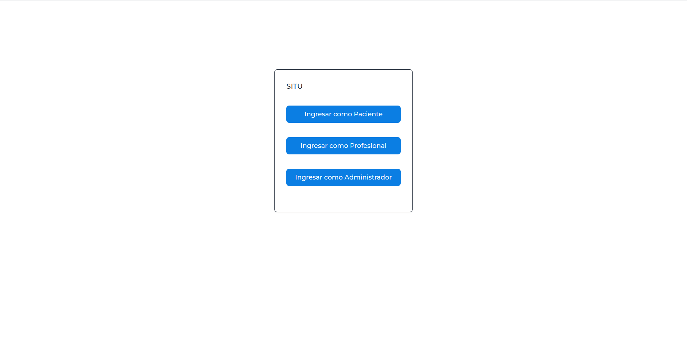
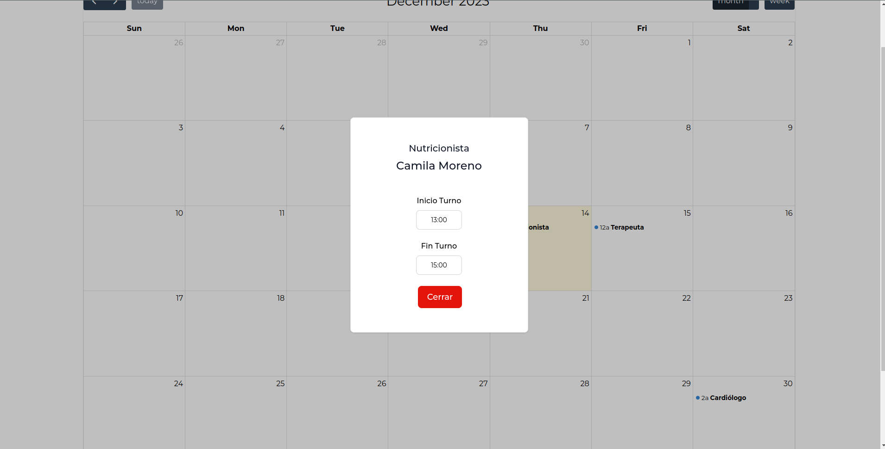
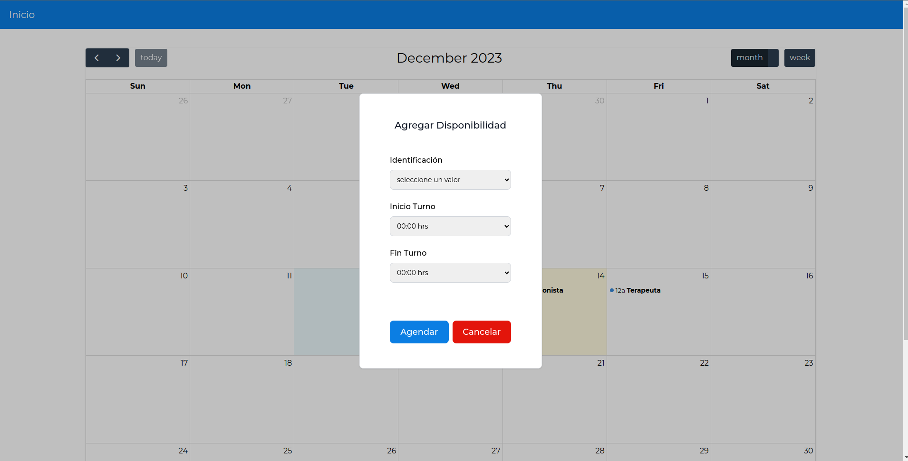
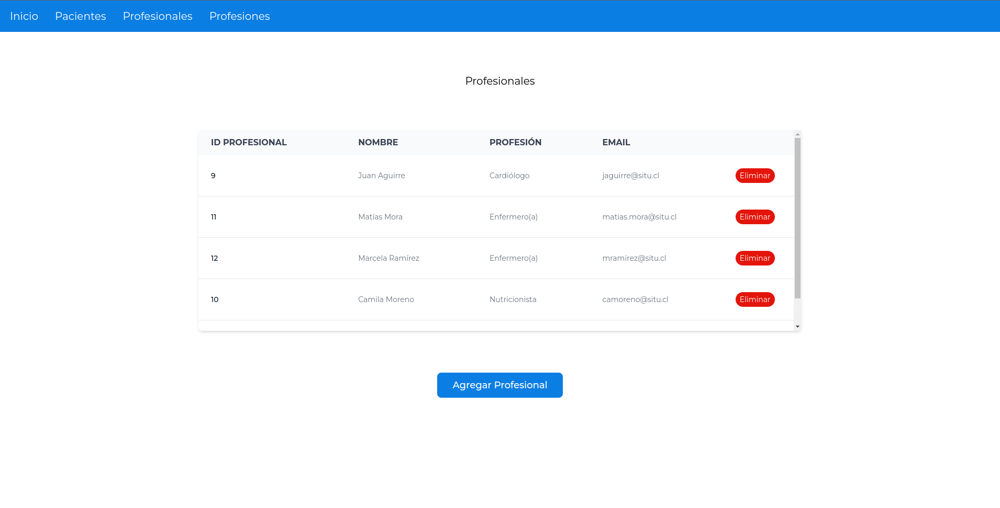

# SITU FRONTEND


## Link a la App

[https://situ-frontend-javiinostroza.vercel.app/](https://situ-frontend-javiinostroza.vercel.app/)

Este módulo corresponde al frontend de la app requerida para postular a Situ. Fue realizado utilizando el framework Nextjs y el calendario fue construido con [FullCalendar](https://fullcalendar.io/).


## Installation

```bash
npm install
```

## Running the app
```bash
npm run dev
```

Abrir [http://localhost:3000](http://localhost:3000) para ver la app en modo develpment.

## Documentación

Para acceder a los diagramas y los endpoints de la API, ver la documentación en [https://github.com/javiinostroza/situ_backend](https://github.com/javiinostroza/situ_backend).

La App cuenta con una vista principal, donde se puede escoger si se desea ingresar como Paciente, Profesional o Administrador.

Si se ingresa como paciente, el usuario tendrá acceso al calendario, donde podrá ver el detalle de las agendas presionando los eventos disponibles.

Si ingresa como Profesional, a diferencia del paciente, podrá agendar su disponibilidad presionando una casilla de fechas y llenando el formulario.

Finalmente, si ingresa como Administrador, podrá agregar/eliminar pacientes (el flujo de reserva de horas por parte del paciente no fue implementado), agregar/eliminar profesionales y profesiones.



